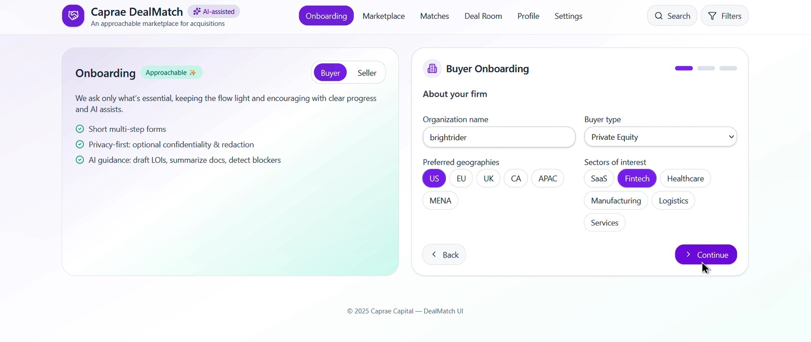
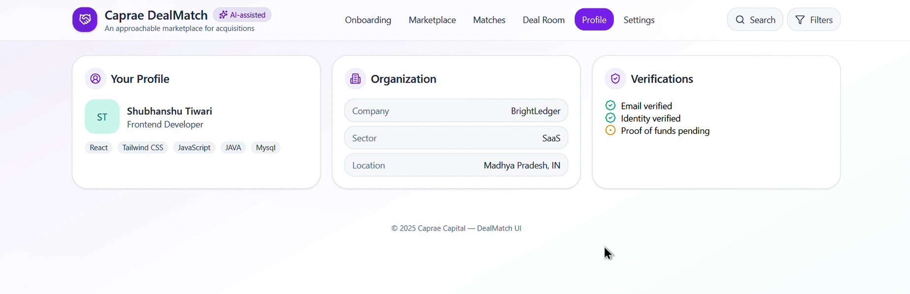

# Caprae DealMatch — Two-Sided Acquisition Marketplace (UI Demo)

An approachable, **AI-assisted** React UI that connects **business sellers** with **qualified buyers**.
Like Bumble’s “flip,” **sellers initiate** conversations with buyers. After a match, both parties collaborate in a guided **Deal Room** that reduces friction and maximizes completion rates.

---

## Table of Contents

* [What This Project Does](#what-this-project-does)
* [Core Flows](#core-flows)
* [UI/UX Principles](#uiux-principles)
* [Tech Stack](#tech-stack)
* [Video Demo](#video-demo)
* [Screenshots](#screenshots)
* [Getting Started](#getting-started)

  * [Option A: Use in an Existing React + Tailwind App](#option-a-use-in-an-existing-react--tailwind-app)
  * [Option B: Create a Fresh Vite + Tailwind Project](#option-b-create-a-fresh-vite--tailwind-project)
  * [Build & Deploy](#build--deploy)
* [Architecture Notes](#architecture-notes)
* [What’s Mocked vs Real](#whats-mocked-vs-real)
* [Roadmap](#roadmap)
* [Project Links](#project-links)
* [License](#license)
* [Credits](#credits)

---

## What This Project Does

Most acquisition platforms feel complex and fragmented. **DealMatch** delivers a **friendly, guided experience** so buyers and sellers can move smoothly from intro → NDA → LOI → closing.

* **Two-sided onboarding** with tailored flows for **buyers** and **sellers** (essential signals only).
* **Seller-led marketplace**: sellers review **buyer cards** and choose **Match** or **Reject** at a glance.
* **Deal Room built for momentum**: progress tracker, AI-assisted document analysis, templates, Q\&A, blockers, checklists, and timeline.
* **AI assists (simulated)**:

  * Financial **Document Analyzer** (summary, risks, suggested questions)
  * **Smart Templates**: NDA, LOI, Q\&A Matrix, Closing Checklist
  * **Blockers detection**: overdue NDA, missing reconciliations, etc.

---

## Core Flows

### 1) Onboarding (Buyer & Seller)

* **Buyer** collects: organization, buyer type (Strategic/PE/FO/Search/Individual), geographies, sectors, **check-size range**, timeline, **proof-of-funds**, **AI assistance** toggle.
* **Seller** collects: company, sector, geography, **ARR & EBITDA**, **confidentiality** preference, **data room ready**, **AI redaction**.

> Implemented by `BuyerOnboarding` and `SellerOnboarding` with a progress `Stepper` and reusable inputs (`Input`, `Select`, `MultiSelect`, `Toggle`, `Number`).

### 2) Marketplace (Seller View of Buyers)

* **Buyer cards** show: type, sector badges, **check size**, **dry powder**, **geography**, **timeline**, **credibility score**, **response rate**, and **preference** summary.
* Actions: **Match** (creates a match and navigates to Matches), **Reject**, **View profile** (modal with Snapshot / Fit Notes / Signals).

> Implemented by `BuyerCard`, `BuyerProfileModal` using `MOCK_BUYERS`.

### 3) Matches

* Lists active matches with stage labels. Open a match to enter the **Deal Room**.

> Implemented by `Matches` with items like `{ id, buyer, stageLabel }`.

### 4) Deal Room (Guided Workspace)

* **DealProgress** across stages: *Intro & NDA → Data Room → Q\&A → LOI → Due Diligence → Terms & Valuation → Financing → Definitive Docs → Closing & Transition*.
* **AI Financial Document Analyzer** (simulated): upload → analyze → summary, anomalies, suggested diligence questions, export.
* **Smart Templates**: one-click creation for NDA/LOI, Q\&A Matrix, Closing Checklist.
* **Q\&A Workspace**: threaded questions, **Suggest answer (AI)**, attachments.
* **Blockers Panel (AI)**: overdue/missing items with quick actions.
* **Party Tasks**: buyer/seller checklists with owners and completion state.
* **Timeline**: compact status feed.

> Implemented by `DealRoom`, `AiDocAnalyzer`, `TemplatesPanel`, `BlockersPanel`, `PartyTasks`, `Timeline`.

---

## UI/UX Principles

* **Approachable design language**: soft surfaces, rounded corners, subtle shadows, friendly spacing.
* **Signal-dense cards** for glanceable decisions (credibility, check size, timeline).
* **Guided progression** with clear steps and momentum cues.
* **Micro-interactions** (modal transitions, list layout animations) to reduce cognitive load.

---

## Tech Stack

* **React** — component model & local state (single-file demo)
* **Tailwind CSS** — utility-first styling
* **framer-motion** — animations & presence
* **lucide-react** — icon set
* **Vite** — recommended dev server/build (for full project setup)

> All AI features and uploads are simulated for demonstration.

---

## Video Demo

Add your walkthrough link here after recording:

**Video:** `https://drive.google.com/file/d/15yY9CQb3ahgIZBVpZy05apq1I4C950nb/view?usp=sharing`

Suggested flow to record:

1. Switch **Buyer/Seller** onboarding → step through → review.
2. **Marketplace**: scan buyer cards → **Match** vs **Reject** → open profile modal.
3. **Matches**: open a match.
4. **Deal Room**: Analyzer → Templates → Q\&A → Blockers → Tasks → Timeline → Progress.

---

## Screenshots

Markdown references:

```md






```

---

## Getting Started

### Option A: Use in an Existing React + Tailwind App

1. Install deps:

```bash
npm i framer-motion lucide-react
# Tailwind (if not already installed)
npm i -D tailwindcss postcss autoprefixer
npx tailwindcss init -p
```

2. Configure Tailwind (`tailwind.config.js`):

```js
export default {
  content: ['./index.html', './src/**/*.{js,ts,jsx,tsx}'],
  theme: { extend: {} },
  plugins: [],
}
```

3. Add Tailwind to your global CSS (e.g., `src/index.css`):

```css
@tailwind base;
@tailwind components;
@tailwind utilities;
```

4. Create/replace `src/App.jsx` with the **single-file UI** from this repo.

5. Start:

```bash
npm run dev
```

### Option B: Create a Fresh Vite + Tailwind Project

```bash
# 1) Bootstrap
npm create vite@latest dealmatch -- --template react
cd dealmatch
npm i
npm i framer-motion lucide-react
npm i -D tailwindcss postcss autoprefixer
npx tailwindcss init -p

# 2) Tailwind config (tailwind.config.js):
# content: ['./index.html', './src/**/*.{js,ts,jsx,tsx}']

# 3) Global CSS (src/index.css):
# @tailwind base; @tailwind components; @tailwind utilities;

# 4) Replace src/App.jsx with the demo code
# 5) Run
npm run dev
```

### Build & Deploy

```bash
# Production build
npm run build
# Preview locally
npm run preview
```

* **Vercel / Netlify**

  * Framework: **Vite**
  * Build command: `npm run build`
  * Output directory: `dist/`

---

## Architecture Notes

* **Single-file React** demo (`App()` root) for fast iteration.
* **Local state “router”** (`active`) to switch major sections:

  * `onboarding`, `marketplace`, `matches`, `deal`, `profile`, `settings`
* **Mock Data**: `MOCK_BUYERS`, `DEAL_STEPS`
* **Reusable UI primitives**: `SectionCard`, `PrimaryButton`, `GhostButton`, `Pill`, `Tag`, `Chip`, `SummaryRow`, `Stepper`, `StepDot`
* **Animations**: `framer-motion` for modals and card layout.

---

## What’s Mocked vs Real

* **Mocked:** buyers list, profile details, matches, deal steps, analyzer output.
* **Simulated:** file uploads & AI processing (via `setTimeout`).
* **Real:** UI architecture, components, UX flows, styling, animations.

---

## Roadmap

* Backend integration (auth, profiles, secure uploads).
* Real **AI** for document parsing, risk scoring, term suggestions.
* Real-time Q\&A with roles/permissions.
* Role-based Data Room with granular access.
* Notifications & calendar integrations.
* Full accessibility pass (ARIA, keyboard navigation, focus management).

---

## Project Links

* **GitHub Repo:** `https://github.com/TShubhanshu/deal-matcher`
* **Video:** `https://drive.google.com/file/d/15yY9CQb3ahgIZBVpZy05apq1I4C950nb/view?usp=sharing`

---

## License

MIT for demo purposes. Adapt for internal use as needed.

---

## Credits

* Icons: **lucide-react**
* Animations: **framer-motion**
* Styling: **Tailwind CSS**
